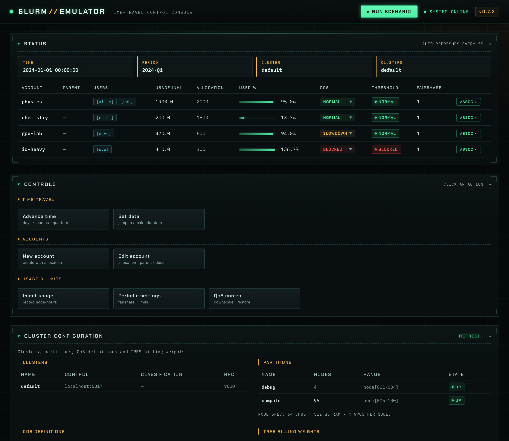
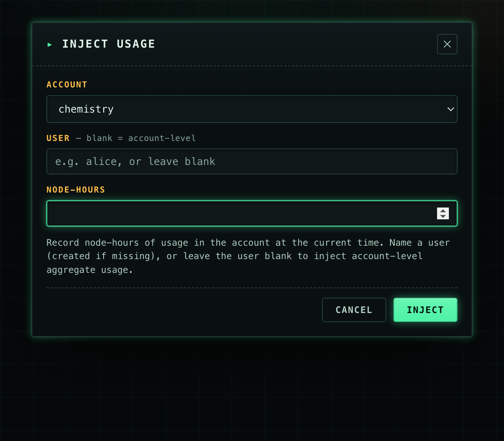
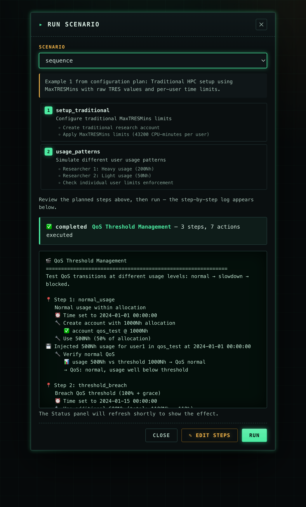
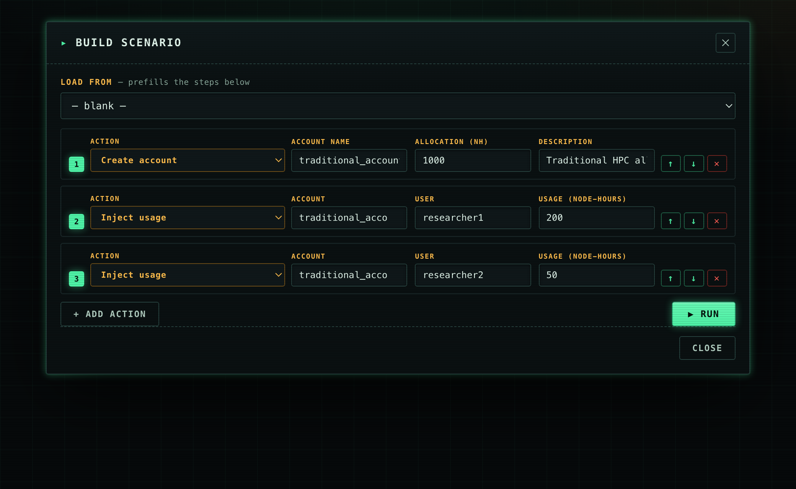
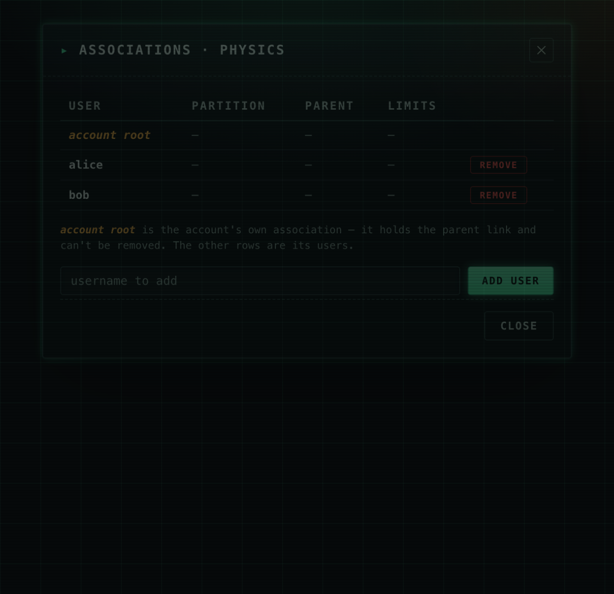
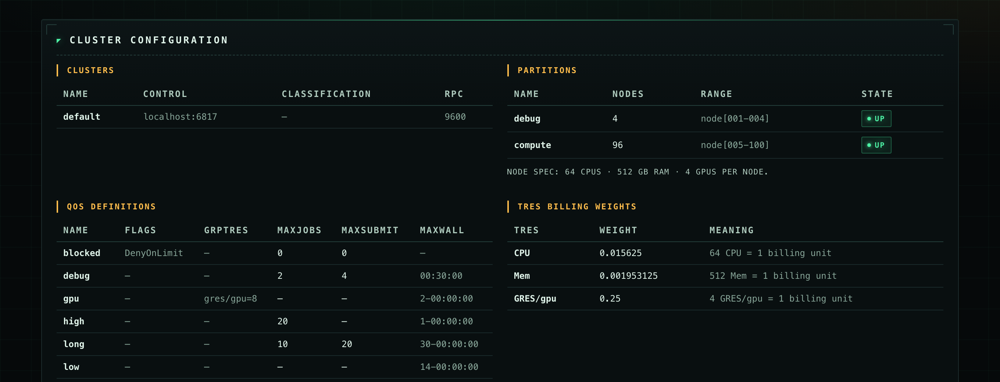

# SLURM Emulator — Web UI

A lightweight, browser-based **control console** for the SLURM Emulator. It is
mounted on the existing API server at **`http://localhost:8080/ui/`** and shares
the same in-memory state as the CLI and JSON API — no build step, no separate
process. Built with HTMX + Jinja2; the only external asset is the display font.

## Running it

```bash
SLURM_EMULATOR_UI_USER=admin SLURM_EMULATOR_UI_PASSWORD=secret \
  uv run uvicorn emulator.api.emulator_server:app --host 0.0.0.0 --port 8080
# then open http://localhost:8080/ui/
```

All `/ui` routes are protected by **HTTP Basic auth** via
`SLURM_EMULATOR_UI_USER` / `SLURM_EMULATOR_UI_PASSWORD` (defaults `admin`/`admin`
with a startup warning; put it behind TLS if exposed beyond localhost).

## Dashboard

Every panel is collapsible (click its header). The **Status** panel
auto-refreshes every 5s.



- **Status** — time / period / cluster, and a per-account table with usage,
  allocation, used-% meter, an **editable QoS dropdown** (limited to the
  cluster's QoS classes), a computed threshold badge, users, and a per-row
  **ASSOC** action.
- **Controls** — grouped actions (Time travel · Accounts · Usage & limits);
  each opens a focused modal. **Run scenario** is promoted to the header.

## Controls (modals)

Each control opens a modal loaded fresh from the server, so account fields are
always-current dropdowns. Usage can be recorded per-user or, leaving the user
blank, as account-level aggregate.



Available controls: advance / set time, create account, edit account
(allocation · parent · description), inject usage, apply periodic settings,
QoS downscale/restore.

## Run a scenario (with step preview)

Selecting a scenario previews its planned **steps** before running. Running it
executes against live state and streams the captured **step-by-step log** into
a terminal panel. Use **✎ Edit steps** to adjust it first.



## Scenario editor

Build or adjust a scenario as an ordered list of typed actions — pick an action
type per row, fill its labelled fields, reorder / add / remove rows — then run
it (ephemeral, run-only). Prefill from any existing scenario with **Load from**.



## Account associations

The per-account **ASSOC** action opens a modal listing that account's
associations, where you can **add** or **remove** users. The `account root` row
is the account-level association (holds the parent link) and can't be removed.



## Cluster configuration

Clusters, partitions (+ node spec), the seeded **QoS definitions**, and TRES
billing weights.



---

> Screenshots are rendered from the live UI. Because the console's ambient
> lighting is viewport-anchored, the full-page dashboard capture omits the CRT
> vignette overlay for even readability; in the running app the scanline/vignette
> effect is present.
