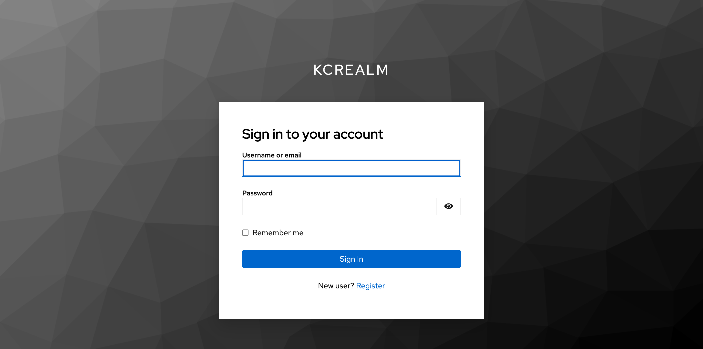
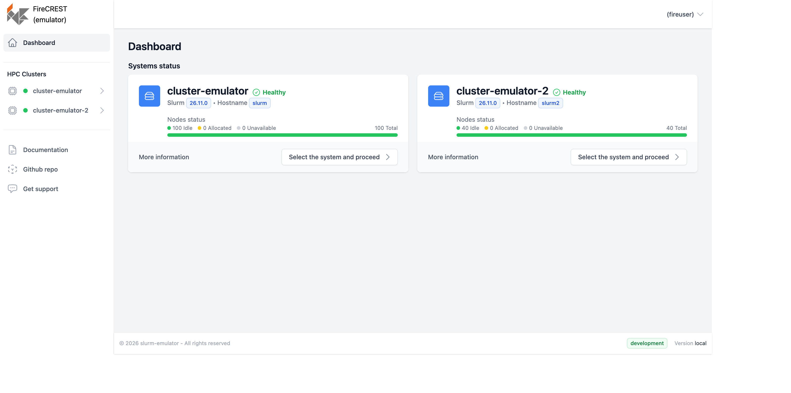
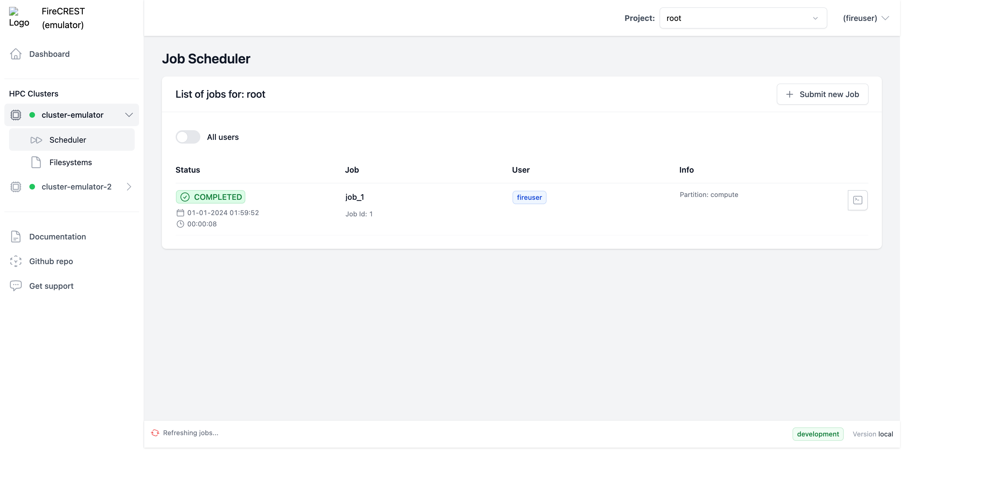
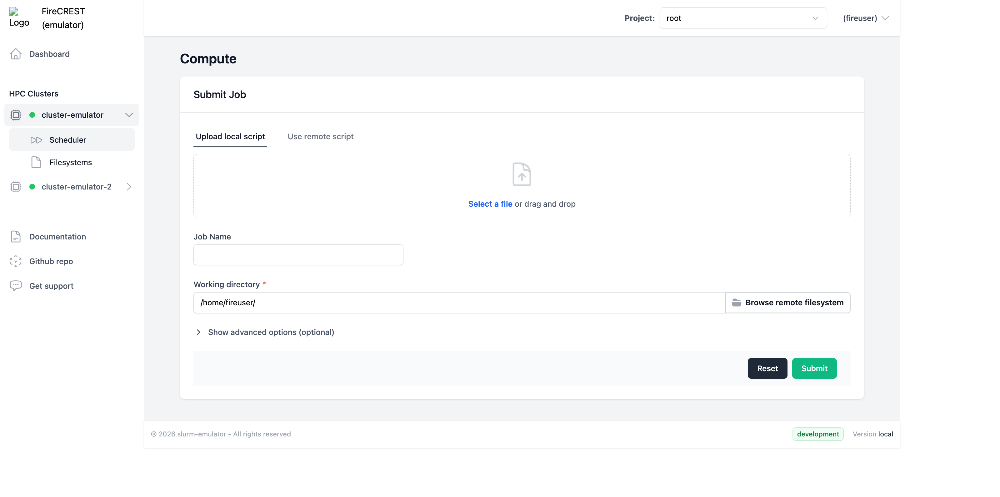
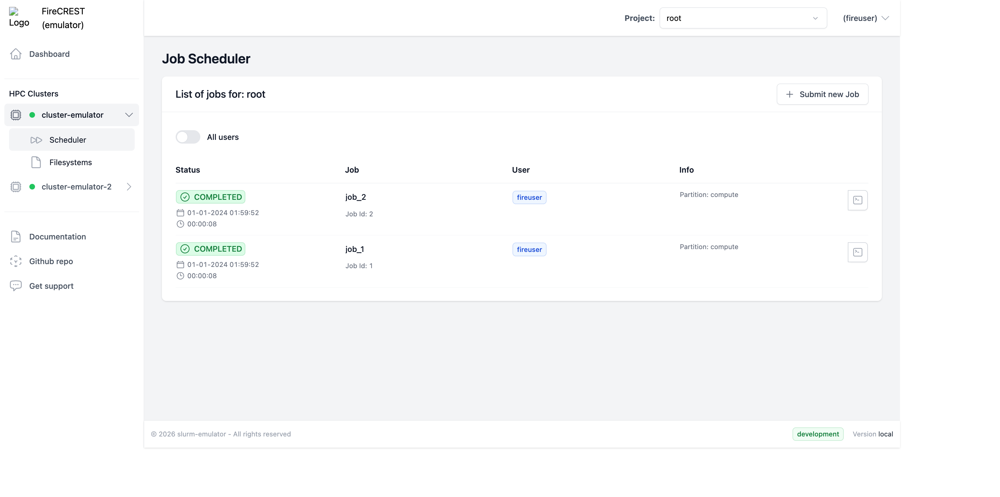
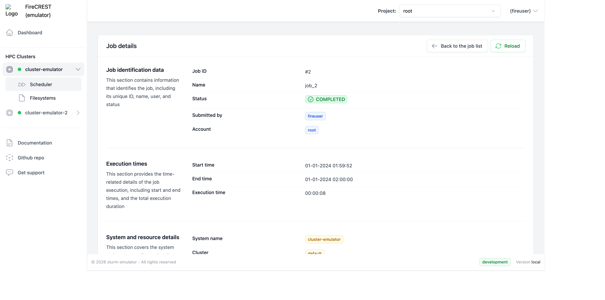
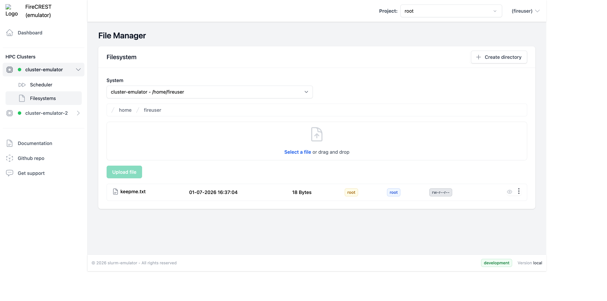
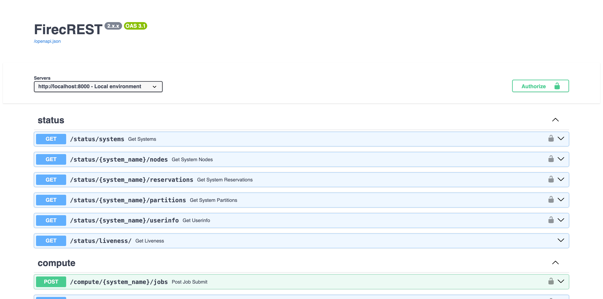

# Running & evaluating the SLURM emulator with FireCREST

This guide shows how to run the [FireCREST v2](https://github.com/eth-cscs/firecrest-v2)
API and [firecrest-ui](https://github.com/eth-cscs/firecrest-ui) against the SLURM
emulator — no real HPC cluster required — and how to evaluate that the emulator
behaves like a real Slurm cluster from FireCREST's point of view.

The emulator plays the **cluster**: it serves the `slurmrestd` REST API and a
login-node SSH plane (filesystem + `sbatch`/`sacct`/…). FireCREST and Keycloak run
unmodified. See [`conformance.md`](conformance.md) for the
field-by-field parity matrix.

## `examples/firecrest/e2e/` vs `examples/firecrest/ui/`

Both wire the emulator into FireCREST, but for different purposes:

| | `examples/firecrest/e2e/` | `examples/firecrest/ui/` |
|---|---|---|
| **What it is** | A docker-compose **overlay** applied on top of FireCREST v2's *own* `docker-compose.yml` | A **self-contained** stack (its own `docker-compose.yml`) |
| **Goal** | Swap the real `slurm` service for the emulator in FireCREST's upstream compose and run its existing services | Run the whole **UI → API → emulator** experience for demos/evaluation |
| **Includes the Web UI?** | No — API + upstream infra only | **Yes** (`firecrest-ui` service) |
| **Auth / infra** | Reuses FireCREST's upstream Keycloak/OpenFGA/MinIO/PBS | Ships a minimal Keycloak (realm `kcrealm`, user `fireuser`) |
| **Clusters** | One (the swapped `slurm`) | **Two** (`cluster-emulator`, `cluster-emulator-2`) with distinct topologies + persistence |
| **How to run** | `examples/firecrest/e2e/run.sh` (clones firecrest-v2, `docker compose -f docker-compose.yml -f overlay.yml`) | `examples/firecrest/ui/up.sh` |

**Short version:** use `examples/firecrest/ui/` to *use and evaluate the UI* (this
guide); use `examples/firecrest/e2e/` to test the emulator inside FireCREST's own
upstream compose (scheduler REST plane, CI-style).

## Prerequisites

- Docker + Docker Compose v2, `git`, `ssh-keygen`.
- A hosts entry so the OIDC issuer URL resolves the same in the browser and the
  containers:

  ```bash
  sudo sh -c 'echo "127.0.0.1 keycloak" >> /etc/hosts'
  ```

## Run it

```bash
cd examples/firecrest/ui
./up.sh            # clones firecrest-v2 (for the API image), writes dev secrets, docker compose up
```

`up.sh` brings up: two emulator clusters (`slurm`, `slurm2`), Keycloak, the
FireCREST API, and the UI. When it settles, open **http://localhost:3000**.

## Walkthrough

### 1. Log in

The UI redirects to Keycloak (realm `kcrealm`). Sign in as **`fireuser` /
`password`**.



### 2. Dashboard — cluster health & topology

Both clusters report **Healthy** (scheduler / SSH / filesystem probes) with their
node counts. They're deliberately given different topologies so multi-cluster is
obvious: `cluster-emulator` = 100 nodes (debug + compute), `cluster-emulator-2` =
40 nodes (gpu + compute).



### 3. Scheduler — list jobs

Per-cluster, per-account job list. Completed jobs come from the emulator's
accounting view; active jobs from its `slurmrestd` job list (FireCREST merges
both).



### 4. Submit a job

The form supports **uploading a local script** or **using a remote script path**.
Remote-file submission goes over SSH `sbatch` (the cluster is configured
`connection_mode: hybrid`), while normal job operations use `slurmrestd`.



After submit, the job appears in the list and advances
PENDING → RUNNING → COMPLETED on its own (wall-clock lifecycle).



### 5. Job details

Full job record — state, account, start/end times, execution time, nodes,
partition, working directory.



### 6. Filesystem browser

Browse `/home/<user>`, upload/download files, create directories — all served by
the emulator's SSH plane running real coreutils. Uploaded files persist across
restarts (see below).



## Evaluating the emulator

### Via the FireCREST API directly

The API's OpenAPI/Swagger UI is at **http://localhost:8000/docs** — exercise
compute/filesystem/status endpoints against the emulator without the UI.



Or with `curl` (mint a token from Keycloak first):

```bash
TOKEN=$(curl -sS -X POST \
  "http://localhost:8080/auth/realms/kcrealm/protocol/openid-connect/token" \
  -d grant_type=password -d client_id=firecrest-web-ui \
  -d client_secret=UI4RiquLaPAT31WsrrKk8UllYkfnnu4t \
  -d username=fireuser -d password=password -d scope=openid \
  | python3 -c "import sys,json;print(json.load(sys.stdin)['access_token'])")

# cluster health (scheduler / ssh / filesystem probes)
curl -sS -H "Authorization: Bearer $TOKEN" http://localhost:8000/status/systems

# submit + list + inspect
curl -sS -X POST -H "Authorization: Bearer $TOKEN" -H 'Content-Type: application/json' \
  -d '{"job":{"name":"eval","partition":"compute","workingDirectory":"/home/fireuser","script":"#!/bin/bash\necho hi"}}' \
  http://localhost:8000/compute/cluster-emulator/jobs
curl -sS -H "Authorization: Bearer $TOKEN" http://localhost:8000/compute/cluster-emulator/jobs
```

### Automated conformance

Drive FireCREST's own client / assert response shapes without the full stack:

```bash
uv run --extra dev pytest tests/test_firecrest_contract.py     # in-repo contract
FIRECREST_SRC=/path/to/firecrest-v2 uv run --extra dev pytest tests/firecrest/  # real client
```

### Multi-cluster & persistence

- **Multi-cluster:** each `clusters:` entry in `firecrest/config.yaml` is an
  independent system, addressed by name (`/compute/{system}/…`) and shown in the
  UI's "HPC Clusters" nav. Topology is set per instance via
  `SLURM_EMULATOR_PARTITIONS` (e.g. `gpu:8,compute:32`).
- **Persistence:** each cluster's job/accounting state and `/home` live on named
  Docker volumes, so jobs and uploaded files survive `docker compose restart` and
  container recreation. (The dashboard above shows a job that persisted across a
  restart.)

## Stop

```bash
cd examples/firecrest/ui
docker compose down        # keep persisted volumes
docker compose down -v     # also wipe state/home volumes
```
